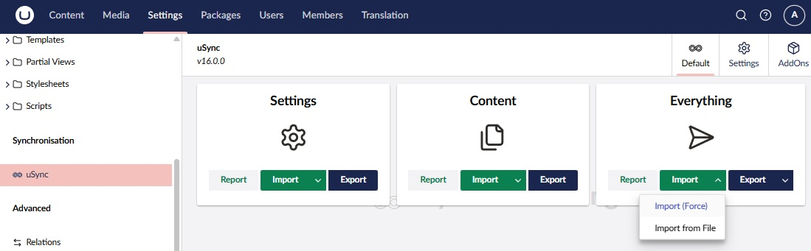

# Umbraco v9, v10, v11 & v16 Demo 
Demo site build in Umbraco v.9.4.2 / v11.1.0 (.Net 7.0) / v16.0.0 (.Net 9.0)

Find v16 in [Umbraco16DemoSite](Umbraco16DemoSite).

**Import _uSync_ not with the default button. Instead choose _import (Force)_ from button dropdown menu:**

[Login info](#login)

## About this solution:

This is a demo site for Umbraco v9 (latest update v16) build in the new .NET Core v5 / v9 version. 
It is built as an experiment/investigation and should not be used as a template for your next Umbraco site.
Use it as a reference if you will and steal whatever you like and ignore the things you dont.

This is not **the way** of building Umbraco sites, it's **a way**. There are less complex ways of building Umbraco sites *(using ModelsBuilder for example, [see discussion](https://github.com/Adolfi/UmbracoDemoSite/issues/10))* so if you are new to Umbraco make sure you [read the official docs](https://our.umbraco.com/documentation/) and don't use this this project as your only source of inspiration.

### Content:
- [Every page is rendered through a RenderController *(Route Hijacking)*](UmbracoDemoSite.Core/Features/Home/HomeController.cs).
- [Every Blocklist item is rendered with block specific ViewComponents with strongly typed view models](UmbracoDemoSite.Web/Views/Partials/_BlockList.cshtml).
- [Every view uses strongly typed View Models *(inheriting from ContentModel)*](UmbracoDemoSite.Web/Views/Home.cshtml).
- [Page components that handles logic are rendered through ViewComponents](UmbracoDemoSite.Core/Features/Shared/Components/Header/HeaderViewComponent.cs).
- [View components have Unit Tests](UmbracoDemoSite.Tests/Unit/Features/Shared/Components/Footer/FooterViewComponentTests.cs).
- [Non-logic components are rendered through Partial views](UmbracoDemoSite.Web/Views/Partials/_SectionHeader.cshtml).
- [Custom services are registered in the IUmbracoBuilder through an IComposer](UmbracoDemoSite.Core/Features/Shared/Settings/SiteSettingsComposer.cs).
- [Constant classes are used when accessing content or property to avoid spreading magic strings](UmbracoDemoSite.Core/Features/Shared/Constants/PropertyAlias.cs).
- [Forms are submitted through a SurfaceController](UmbracoDemoSite.Core/Features/Shared/Components/ContactForm).
- [Examine searching. (#h5yr Andrey Karandashov)](UmbracoDemoSite.Core/Features/Search)
- [Products are fetched from external source and rendered using a ContentFinder](UmbracoDemoSite.Core/Features/Products/ProductsContentFinder.cs).
- [Site Settings](/UmbracoDemoSite.Core/Features/Shared/Settings) and [Variables](UmbracoDemoSite.Core/Features/Shared/Variables) for managing settings. See [Variable usage example](/UmbracoDemoSite.Web/Views/ProductPage.cshtml#L22).

#### Unit Tests:
- [RenderController: Home](UmbracoDemoSite.Tests/Unit/Features/Home/HomeControllerTests.cs)
- [RenderController: Page](UmbracoDemoSite.Tests/Unit/Features/Page/PageControllerTests.cs)
- [ViewComponents: ContentBlock](UmbracoDemoSite.Tests/Unit/Features/Shared/Components/ContentBlock/ContentBlockViewComponentTests.cs)
- [ViewComponents: Header](UmbracoDemoSite.Tests/Unit/Features/Shared/Components/Header/HeaderViewComponentTests.cs)
- [ViewComponent: Footer](UmbracoDemoSite.Tests/Unit/Features/Shared/Components/Footer/FooterViewComponentTests.cs)
- [SurfaceController: ContactForm](UmbracoDemoSite.Tests/Unit/Features/Shared/Components/ContactForm/ContactFormControllerTests.cs)
- [UmbracoHelper: SiteSettings](UmbracoDemoSite.Tests/Unit/Features/Shared/Settings/SiteSettingsTests.cs)
- [Relations: NavigationService](UmbracoDemoSite.Tests/Unit/Features/Shared/Components/Navigation/NavigationServiceTests.cs)
- [ContentFinder: Products](UmbracoDemoSite.Tests/Unit/Features/Products/ProductsContentFinderTests.cs)

### Login:
This site uses an embeded SQLCE database to avoid having to restore and keep updating a restore script.
To login to the Umbraco backoffice use these credentials:
- Username: admin@admin.com
- Password: adminadmin

### Read more:
Go to [adolfi.dev](https://adolfi.dev) if you want to read more Umbraco and Unit Testing articles.

### Umbraco v10.4.0
Find an upgraded version in [UmbracoTenDemoSite](UmbracoTenDemoSite).
This version uses uSync. You may use Sqlite as you database.

### Umbraco v11.1.0
Find an upgraded version in [UmbracoElevenDemoSite](UmbracoElevenDemoSite).
This version uses uSync. You may use Sqlite as you database.

### Umbraco v16.0.0
The solution can be found in [Umbraco16DemoSite](Umbraco16DemoSite).
This version uses uSync. You may use Sqlite as you database.

#### Testing:
There is a new build configuration called `Testing` that will buid the _UmbracoDemoSite.Tests_ project to run all tests.
In both other configurations thhis project will not be built!